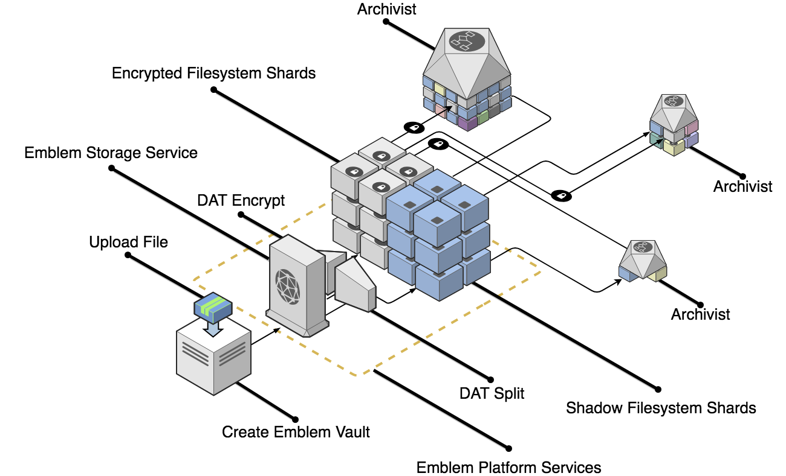

```
HD Scheme Suite
    Derive
      ✓ returns an empty array when no key is provided
      ✓ returns an array of 16 items when provided a valid key (105ms)
      ✓ returns an array of 17 items when provided a valid key and a qty of 17 (165ms)
      ✓ returns valid keys (72ms)
      ✓ creates Dat in ram when option is specified (67ms)
    Derive Async
      ✓ resolves all promises (166ms)
    Generate Root HD Key
      ✓ generates a unique key each time
    Split key
      ✓ provides an array of 16 hex words
    Split Keys To Paths
      ✓ returns array of integer paths
    Derive children
      ✓ Derives valid HDKeys (79ms)
    Derive specific child
      ✓ Derives expected key when provided an index of 0 (184ms)
      ✓ Derives expected key when provided an index of 1 (80ms)
      ✓ Derives expected key when provided an index greater than 16 (162ms)
      ✓ Derives expected key when provided an index less than 16 (87ms)
    Generate Dat Key
      ✓ should generate a random ed25519 keypairs
      ✓ should generate deterministic keys when provided a known seed
    Generate Dat
      ✓ creates a valid dat from provided key
      ✓ generates 16 Dat objects when no qty is provided (265ms)

  Dat storage
    ✓ stores data in single dat (217ms)
    ✓ dat is servable over http (222ms)
    ✓ should return secret and shadowed collection when passed folder path (395ms)
    ✓ should be able to read metadata from shadowed collection of one file (360ms)
    ✓ should be able to read metadata from shadowed collection of multiple files (401ms)
    ✓ should be able to read metadata from shadowed collection of multiple and nested files (608ms)
    ✓ should hash file content (710ms)


  25 passing (6s)
```